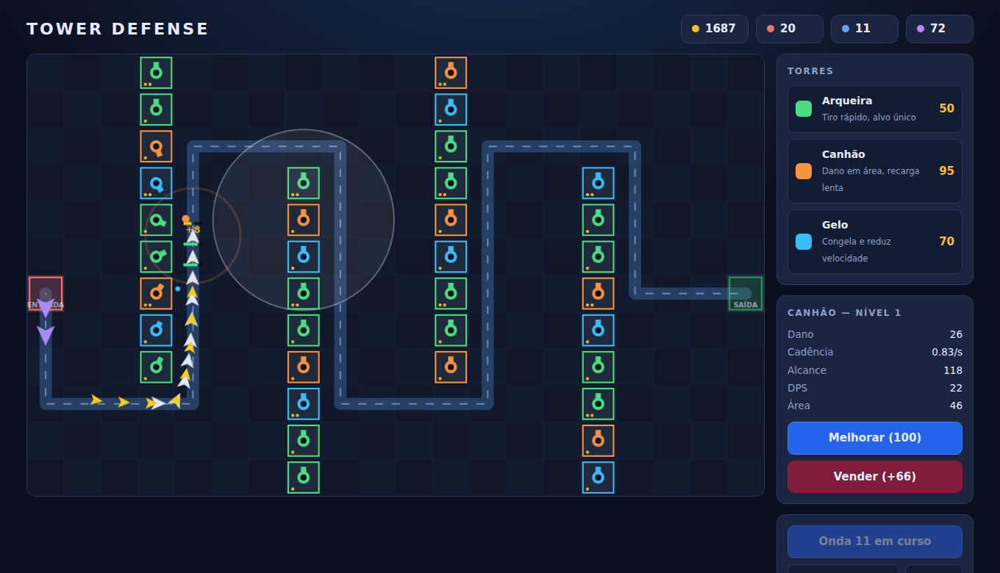

# Tower Defense

Um tower defense jogável em **HTML5 Canvas + JavaScript puro**. Sem dependências,
sem build, sem servidor: abra o `index.html` no navegador e jogue.




## Como jogar

1. Baixe ou clone o repositório.
2. Abra `index.html` (duplo clique já funciona — os scripts são clássicos, não módulos ES).
3. Clique em **Começar**.

Prefere servir por HTTP? `npx serve .` ou `python3 -m http.server` também funcionam.

## A mecânica central

Não existe caminho fixo no mapa. Um **campo de fluxo** (BFS a partir da saída)
calcula, para cada célula livre, a distância até a saída e a direção do próximo
passo. Cada torre construída é um obstáculo, então **construir remodela a rota de
todos os inimigos de uma vez**.

O objetivo real do jogo é esse: montar um labirinto que alongue o percurso ao
máximo, dando mais tempo de tiro às suas torres. O mesmo BFS é o árbitro do que
pode ser construído — se bloquear a célula deixaria a entrada (ou algum inimigo
vivo) sem rota até a saída, a construção é recusada e desfeita.

As torres também usam o mapa de distâncias para mirar: o alvo escolhido é sempre
o inimigo **mais adiantado** dentro do alcance, ou seja, o que está mais perto de vazar.

## Torres

| Torre | Custo | Perfil |
|---|---|---|
| Arqueira | 50 | Tiro rápido, alvo único. O carro-chefe de dano sustentado. |
| Canhão | 95 | Dano em área, recarga lenta. Resolve aglomerados. |
| Gelo | 70 | Dano baixo, mas reduz a velocidade. Multiplica o DPS das vizinhas. |

Cada torre tem 3 níveis. Vender devolve 70% do total investido.

## Inimigos e ondas

| Inimigo | Perfil |
|---|---|
| Grunt | Equilibrado, o volume da onda. |
| Veloz | Pouca vida, quase o dobro da velocidade. |
| Tanque | Muita vida, lento, custa 2 vidas se vazar. |
| Chefe | A cada 10 ondas. Custa 6 vidas. |

As ondas são infinitas e a vida escala em `1,155^(onda-1)` — o jogo não termina em
vitória, ele aperta até você perder. A pontuação é o quanto você aguentou.

Chamar a próxima onda antes do fim do intervalo rende ouro extra proporcional ao
tempo que sobrou: o risco calculado é a principal alavanca de economia.

## Atalhos

| Tecla | Ação |
|---|---|
| `1` `2` `3` | Escolher torre |
| `N` | Chamar a próxima onda |
| `Espaço` | Pausar / retomar |
| `Esc` | Cancelar seleção |
| Botão direito | Cancelar seleção |

Há também controle de velocidade (1x / 2x / 3x) na barra lateral.

## Estrutura

```
index.html          marcação e ordem de carga dos scripts
css/style.css       tema, HUD e barra lateral
js/config.js        constantes de mundo e balanceamento
js/grid.js          grid, BFS e campo de fluxo
js/enemy.js         inimigos
js/tower.js         torres, mira e upgrades
js/projectile.js    projéteis, dano direto e em área
js/waves.js         gerador de ondas infinitas
js/renderer.js      desenho em Canvas 2D
js/ui.js            ponte entre estado e DOM
js/game.js          estado e regras
js/main.js          entrada, loop e atalhos
docs/preview.png    captura usada no README
```

A separação é deliberada: `game.js` não toca no DOM e `renderer.js` não altera
estado. Dá para rodar a simulação inteira sem tela — foi assim que o
balanceamento acima foi medido.

## Ajustando o balanceamento

Tudo que importa está em `js/config.js`: ouro e vidas iniciais, tamanho do grid,
estatísticas de cada nível de torre e de cada inimigo. A curva de dificuldade
está em `js/waves.js` (`hpMultiplier` e `build`).

## Licença

MIT — veja [LICENSE](LICENSE).
