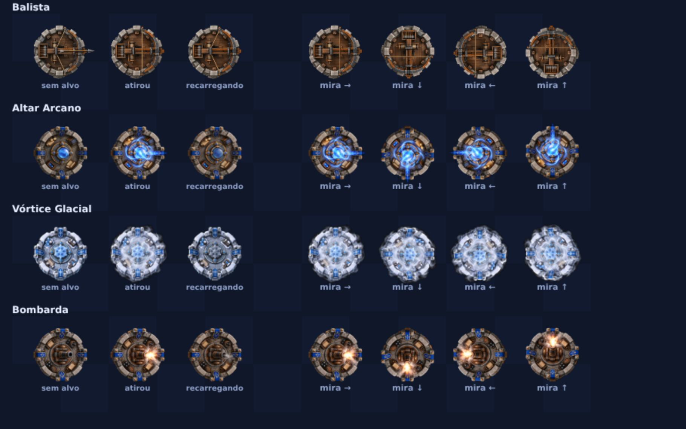
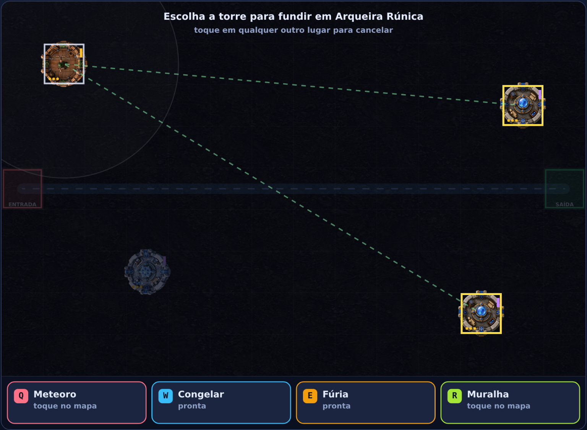
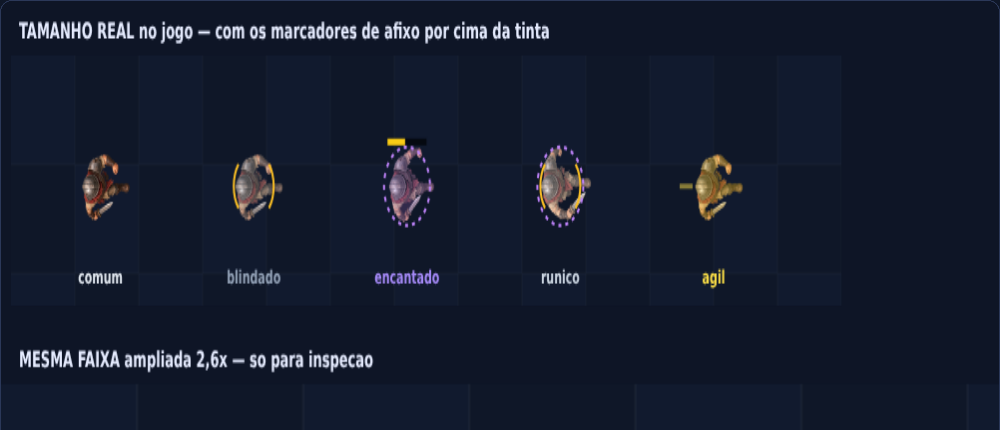
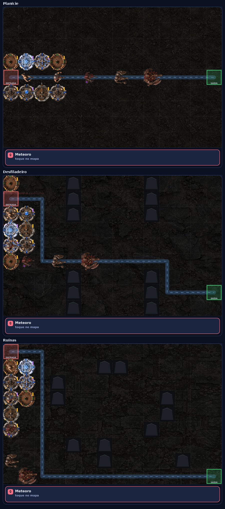
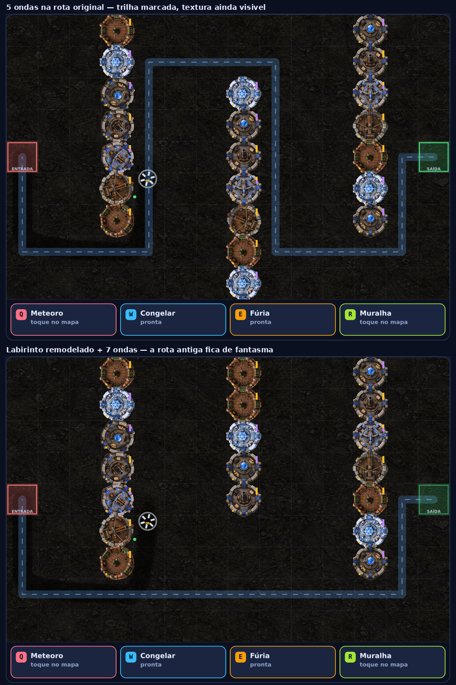
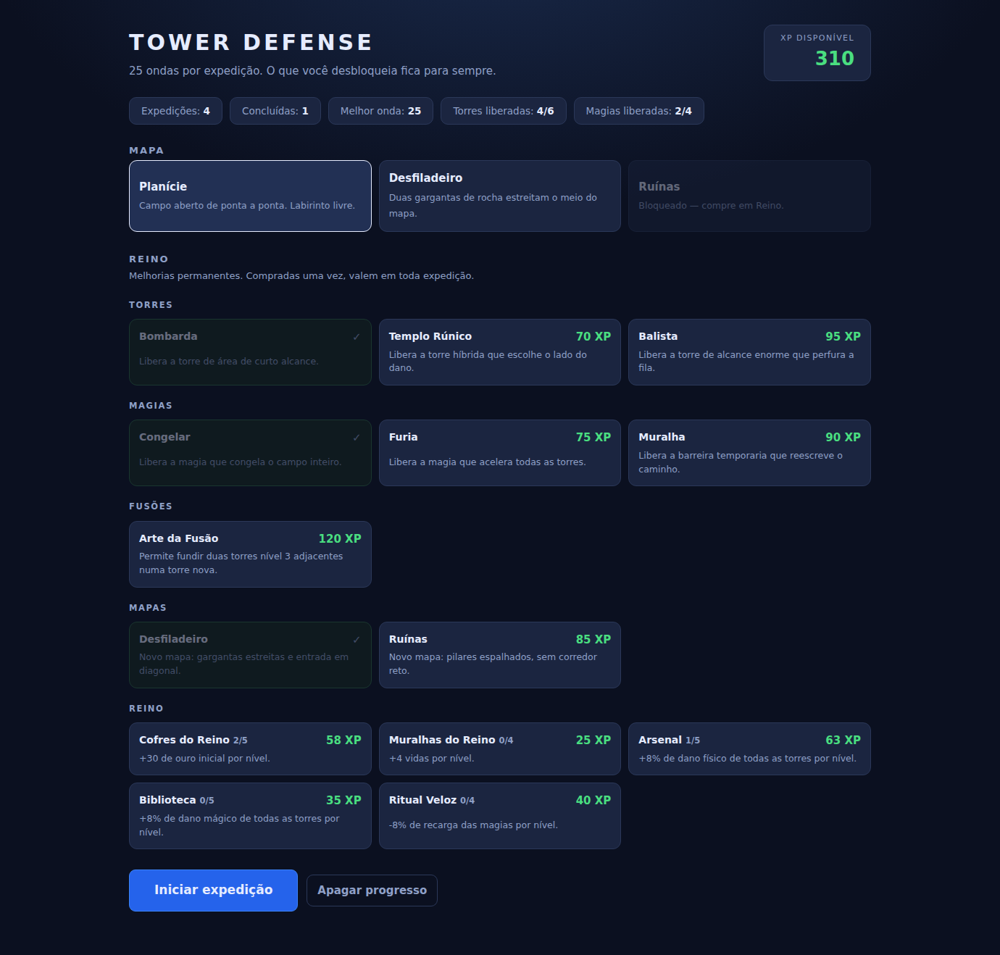

# Tower Defense

Um tower defense jogável em **HTML5 Canvas + JavaScript puro**. Sem dependências,
sem build, sem servidor: abra o `index.html` no navegador e jogue.


## Como jogar

1. Baixe ou clone o repositório.
2. Abra `index.html` (duplo clique já funciona — os scripts são clássicos, não módulos ES).
3. Compre o que der no menu, escolha o mapa e inicie a expedição.

No tabuleiro: **toque curto** numa torre seleciona e mostra o alcance;
**toque longo** (ou botão direito) abre o menu de evolução, fusão e venda.
As magias ficam na faixa dentro do próprio canvas, logo abaixo do tabuleiro.

Prefere servir por HTTP? `npx serve .` ou `python3 -m http.server` também funcionam.

## A mecânica central: o caminho não é fixo

Um **campo de fluxo** (BFS a partir da saída) calcula, para cada célula livre, a
distância até a saída e a direção do próximo passo. Cada torre é um obstáculo,
então **construir remodela a rota de todos os inimigos de uma vez**.

O jogo é sobre montar o labirinto mais longo possível. O mesmo BFS é o árbitro do
que pode ser construído: se bloquear a célula deixaria a entrada — ou algum
inimigo já em campo — sem rota até a saída, a construção é recusada e desfeita.

As torres também usam o mapa de distâncias para mirar: o alvo é sempre o inimigo
**mais adiantado** dentro do alcance, ou seja, o que está mais perto de vazar.

## Duas escolas de dano

Todo dano é **físico** (amarelo) ou **mágico** (roxo), e cada inimigo tem
resistência separada para cada um. Resistência é redução percentual e **nunca
chega a 100%** — a torre errada sempre faz alguma coisa, só faz pouco.

É isso que faz a variedade de torres importar: contra um Blindado (62% de
resistência física), 100 de dano físico viram 38, enquanto 100 de dano mágico
passam inteiros.

## Arte das torres

As seis torres têm sprites pintados com ciclo de tiro de três quadros. O sistema
é genérico — basta acrescentar o conjunto em `js/sprites.js`. As torres fundidas
ainda usam o desenho vetorial. O sistema é genérico — basta acrescentar o
conjunto em `js/sprites.js` para uma torre passar a usar arte.



| Torre | Sem alvo | Acabou de atirar | Recarregando |
|---|---|---|---|
| Balista | virote carregado | corda solta | corda armada, vazia |
| Altar Arcano | orbe carregado | feixe e arcos de energia | orbe apagado |
| Vórtice Glacial | floco nítido | névoa girando | floco pálido e drenado |
| Bombarda | canhão limpo | labareda e faíscas | cano fumegando |
| Templo Rúnico | virote arcano carregado | corda solta e descarga | corda armada, vazia |
| Arqueira | arco relaxado | flecha em voo | arco sendo armado |

Três detalhes que fazem isso funcionar:

- **O quadro sai da recarga que a torre já controla**, não de um timer separado.
- **Os três quadros de cada torre são recortados na mesma janela**, centrada no
  disco de pedra. O centro do sprite é o centro da torre, então girar em direção
  ao alvo gira em torno da célula e a animação não treme entre quadros.
- **`angleOffset` corrige a arte que aponta para cima.** O feixe do Altar, a
  labareda da Bombarda e o virote do Templo sobem no desenho, enquanto o ângulo
  0 do jogo aponta para a direita.

Nem todo ciclo lê igual. O da Bombarda e o do Vórtice Glacial são os melhores,
porque neles o que muda é uma massa grande e clara que aparece e some — labareda,
névoa. O da Arqueira é o mais fraco: o arqueiro ocupa cerca de um quarto do
diâmetro do disco, então a 64px os três quadros quase não se separam. Ela
continua perfeitamente identificável como torre; o que não lê é a animação. O
disparo em si o jogador percebe pelo projétil e pelo clarão de boca, que o motor
desenha por cima em qualquer escala.

O Templo Rúnico tem adereços no anel externo (aljava, livros, pergaminhos) que
só existem no quadro carregado. Isso não pisca durante a onda: com alvo em
alcance a torre alterna apenas entre *atirou* e *recarregando*, e o quadro
carregado só aparece quando ela fica sem alvo.

A célula é de **64px** por causa disso: a 48px os três quadros ficavam
indistinguíveis. O custo foi real — o tabuleiro caiu de 240 para 126 células — e
o balanceamento foi remedido por simulação.

## As 6 torres

O eixo de design é explícito: **quanto mais curto o alcance, maior o DPS bruto.**

| Torre | Custo | Escola | Alcance / DPS | Papel |
|---|---|---|---|---|
| Bombarda | 100 | Físico | 92 / 32 | Dano em área. Resolve aglomerados. |
| Vórtice Glacial | 70 | Mágico | 96 / 10 | Lentidão forte. Ver nota abaixo. |
| Templo Rúnico | 120 | Híbrido | 120 / 27 | Metade físico, metade mágico. |
| Altar Arcano | 85 | Mágico | 128 / 24 | Dano constante que ignora armadura. |
| Arqueira | 50 | Físico | 135 / 22 | Tiro rápido, o carro-chefe. |
| Balista | 145 | Físico | 200 / 20 | Perfura a fila inteira. |

O Glacial é a única exceção à regra, e é deliberada: ele não paga em dano, paga
em lentidão. Medir o Glacial pelo DPS dele é medir a coisa errada — o valor dele
é o DPS que ele **adiciona às vizinhas**.

## Evolução ramificada

Cada torre tem 3 níveis, e nos níveis 2 e 3 o jogador escolhe entre **dois
caminhos exclusivos**. São 4 estados finais distintos por torre, 24 no total.

O eixo da escolha muda conforme a torre:

- **Arqueira** — alcance *ou* dano
- **Balista** — perfuração *ou* dano
- **Bombarda** — raio da área *ou* dano no centro
- **Altar** — cadência *ou* dano
- **Glacial** — intensidade da lentidão *ou* dano
- **Templo Rúnico** — subir o lado **físico** *ou* o lado **mágico**

O Templo é a torre da decisão: o Voto de Aço sobe o físico e derruba o mágico, o
Voto de Runa faz o inverso. Manter o equilíbrio nunca é a opção mais forte contra
um alvo específico, mas é a única que não afunda contra o afixo errado.

## Fusão

Duas torres **nível 3 com receita válida** viram uma torre nova, **em qualquer
lugar do tabuleiro**. A fundida ocupa a célula da selecionada e **libera a
outra** — o labirinto muda junto, então fundir também é uma decisão de terreno.



Segure a torre (ou botão direito) para abrir o menu, escolha a **receita**, e o
tabuleiro escurece deixando acesas só as torres que servem. A parceira é
escolhida no mapa, não numa lista: o jogador precisa ver **onde** ela está,
porque a célula liberada muda o labirinto.

A primeira versão exigia que as duas fossem **vizinhas**, e isso estava errado.
A restrição soa como profundidade, mas o jogador posiciona torre em função do
caminho, não de receita — exigir que o par certo caia lado a lado é pedir
coincidência, e a mecânica quase nunca aparecia. Sem a adjacência ela continua
sendo uma escolha de terreno, só que uma escolha de verdade em vez de um sorteio.

| Receita | Resultado |
|---|---|
| Arqueira + Altar | **Arqueira Rúnica** — flechas híbridas em cadência alta |
| Balista + Bombarda | **Morteiro Pesado** — área enorme com alcance de cerco |
| Altar + Glacial | **Prisma Congelante** — magia em área que congela o grupo |
| Bombarda + Templo | **Forja de Guerra** — explosão híbrida |
| Altar + Balista | **Lança Etérea** — perfura a fila com dano mágico puro |
| Arqueira + Glacial | **Caçadora de Gelo** — tiro rápido que mantém tudo lento |

**A regra de balanceamento é medida, não chutada:** o DPS da fundida fica entre
**80% e 92% da soma** das duas torres nível 3 que ela consome. Acima disso,
fundir vira obrigatório e as 6 torres viram decoração. Abaixo, fundir vira
armadilha e a mecânica inteira é código morto — que foi exatamente o bug que a
primeira versão tinha (as 6 receitas entregavam de 33% a 69%).

A troca real: o jogador perde um pouco de dano bruto e ganha cobertura contra os
dois tipos de resistência, uma célula livre e mais alcance ou área. Em
compensação, concentra o investimento numa célula só, que cobre uma faixa do mapa
em vez de duas.

## Arte dos inimigos

Os cinco inimigos têm sprite pintado com ciclo de passo. O sistema é genérico —
acrescente o conjunto em `js/mobs.js`.

| Inimigo | Na tela | Quadros | Como se identifica |
|---|---|---|---|
| Veloz | 24px | 2 | magro, pálido, sem armadura |
| Grunt | 30px | 3 | elmo prateado e manto vermelho |
| Bruxo | 32px | 2 | manto escuro e orbe roxo |
| Tanque | 40px | 2 | o mais largo, maça de corrente |
| Chefe | 58px | 2 | elmo chifrudo, crânios, machado incandescente |



Três decisões que fazem isso funcionar, e nenhuma delas é óbvia:

- **O quadro vem da distância percorrida, não de um cronômetro.** Quem anda mais
  rápido pisa mais rápido, de graça: um Veloz a 104 de velocidade dá o dobro de
  passos de um Tanque a 34, sem nenhum timer separado para manter em sincronia.

- **O alinhamento tem duas partes, e as duas são necessárias.** O *centro* vem do
  centroide da massa de pixels, não da caixa delimitadora — a caixa cresce e
  encolhe quando arma e braços balançam, e alinhar por ela fazia o Grunt
  escorregar 44px entre quadros. A *escala* vem de uma janela de recorte
  proporcional ao corpo de cada quadro, então todos saem do mesmo tamanho: sem
  isso o Tanque pulsava 12,8% entre os dois passos, por causa da maça de corrente.
  Tentei também um centroide "aparado", que descartava o que estava longe do
  núcleo, e ele piorou tudo — convergia para regiões diferentes conforme a pose.

- **Os afixos são recoloridos no carregamento, não a cada quadro.** Numa onda
  cheia são dezenas de inimigos a 60fps; compor a tinta em tempo real seria
  desperdício. As cinco variantes são pré-tingidas uma vez, a 30% — o bastante
  para o tom deslocar e pouco o bastante para a textura da armadura sobreviver.

E o marcador de forma continua por cima da tinta, que é o que separa **Blindado**
de **Rúnico**: os dois ficam acinzentados, mas um tem só as placas e o outro tem
placas **e** halo. Cor sozinha não daria conta — era a aposta desde o começo e o
teste confirmou.

## Inimigos: 5 silhuetas, 5 afixos

As silhuetas são reaproveitadas entre todas as variantes. O que muda é o **afixo**,
que altera cor **e marcador de forma**:

| Afixo | Marcador | Efeito |
|---|---|---|
| Blindado | placas amarelas | 62% de resistência física. Mais lento. |
| Encantado | halo roxo pontilhado | 62% de resistência mágica. Mais lento. |
| Rúnico | placas **e** halo | 38% nos dois. Bem mais lento e com menos vida. |
| Ágil | rastro | Sem resistência (recebe 15% a mais). Muito mais rápido e frágil. |

O marcador não é enfeite. Resistência é a informação mais urgente da tela e o
jogador tem menos de um segundo para decidir se aquele grupo pede torre física ou
mágica — matiz sozinho falha no meio de uma onda cheia e falha para quem tem
daltonismo.

Os afixos entram escalonados, cada um como uma lição isolada antes de aparecer
misturado: **Ágil na onda 4**, **Blindado na 6**, **Encantado na 9**, **Rúnico na 14**.

## Terreno

Cada mapa tem uma textura pintada desenhada sob a grade, e ela passa por um
ajuste obrigatório antes de entrar no jogo: escurecida para brilho médio 20,
contraste interno comprimido para desvio 7, dessaturada a 40%.



Isso não é gosto, é medida. O critério é **quantas vezes a diferença de brilho
entre o inimigo e o chão cabe dentro do ruído visual do próprio chão** — quanto
maior, mais o inimigo se separa do fundo:

| Chão | Ruído | Destaque do inimigo |
|---|---|---|
| Xadrez liso (o antigo) | 1,5 | 33,8× |
| Terreno procedural | 11,7 | 3,9× |
| Textura **crua** | 17,6 | **1,2×** — o inimigo some |
| Textura ajustada | 7,0 | 5,6× |

A textura crua é bonita e destrói o jogo: brilho 53 contra um Chefe de brilho
59 faz o maior inimigo desaparecer no chão. Depois do ajuste o pior caso fica em
5,6× e o Veloz, que é o menor, passa de 11×.

Um terreno procedural por ruído fBm chegou a ser escrito e foi descartado:
perdeu nas duas dimensões, menos legível que a textura ajustada e sem
identidade visual nenhuma.

`BRILHO` e `DESVIO` no script de processamento são o único botão: menos desvio
deixa o chão mais liso e o inimigo mais visível; mais desvio faz o inverso.

## Trilha pisada

O chão se desgasta por onde os inimigos passam. **Não é uma estrada desenhada —
não poderia ser.** A rota deste jogo é recalculada a cada torre construída, então
qualquer caminho pintado acabaria marcado onde ninguém passa mais.



Aqui a trilha emerge do tráfego: cada inimigo carimba uma mancha suave por onde
anda, num buffer de acúmulo em meia resolução. O carimbo é disparado a cada 5
pixels percorridos, não a cada quadro — assim o custo não muda com a taxa de
quadros nem com a velocidade do jogo.

Três decisões:

- **A mancha escurece em vez de clarear.** Os inimigos são mais claros que o
  chão, então escurecer por onde eles andam aumenta o contraste exatamente na
  faixa onde eles estão.
- **Nunca desbota.** O efeito colateral virou o melhor pedaço: depois de
  remodelar o labirinto no meio da partida, a rota antiga continua marcada ao
  lado da nova.
- **A opacidade tem teto (`TETO`).** O carimbo acumula até saturar, mas a camada
  nunca é desenhada a 100%: sem o teto a trilha vira um sulco preto e apaga a
  textura do mapa justamente onde o jogador mais olha.

A linha azul tracejada continua existindo e não foi substituída. Ela é
instrumento — mostra para onde os inimigos **vão**, que é a decisão central do
jogo. A trilha mostra por onde eles **foram**.

## Magias

Habilidades ativas com recarga própria, utilizáveis no meio da onda.

| Magia | Tecla | Recarga | Efeito |
|---|---|---|---|
| Meteoro | `Q` | 26s | Dano mágico pesado numa área do mapa. |
| Congelar | `W` | 42s | Congela todos os inimigos em campo. |
| Fúria | `E` | 36s | Todas as torres atiram 70% mais rápido por 9s. |
| Muralha | `R` | 30s | Bloqueia uma célula por 11s e força o desvio. |

Muralha é a mais interessante das quatro porque conversa com a mecânica central:
ela reescreve a rota sem custar ouro. Usa a mesma validação das torres — se
selaria o mapa, a magia não é gasta.

## Expedições e meta-progressão

Uma expedição tem **25 ondas**. Terminando ou perdendo, o XP acumulado vai para o
menu e compra desbloqueios permanentes: torres, magias, a Arte da Fusão, mapas
novos e melhorias graduais do Reino (ouro inicial, vidas, dano físico, dano
mágico, recarga de magias).

**Perder também rende XP** — de propósito. Senão o jogador trava sem conseguir
comprar justamente o que precisa para passar da parede em que morreu.

Curva medida por simulação (bot que constrói no caminho, evolui e funde):

| Estado | Resultado |
|---|---|
| Expedição 1, só o inicial | morre na onda 21 de 25 |
| 4 desbloqueios | vence com 1 vida restante |
| Tudo desbloqueado | vence com 36 vidas, 8 torres fundidas |

Comprar tudo custa 3457 XP e uma expedição rende de 500 a 790 — cerca de **6
expedições** para o arco completo.



## Atalhos

| Tecla | Ação |
|---|---|
| `1` … `6` | Escolher torre (na ordem da loja) |
| Toque longo | Abrir o menu da torre (evoluir, fundir, vender) |
| `Q` `W` `E` `R` | Lançar magia |
| `N` | Chamar a próxima onda |
| `Espaço` | Pausar / retomar |
| `Esc` / botão direito | Cancelar seleção |

Chamar a onda antes do fim do intervalo rende ouro extra proporcional ao tempo
que sobrou. Há também controle de velocidade (1x / 2x / 3x).

## Estrutura

```
index.html          duas telas (menu e partida) e ordem de carga dos scripts
css/style.css       tema, HUD, loja, inspetor e menu
js/config.js        constantes, torres, fusões, inimigos, afixos e magias
js/sprites.js       sprites pintados das torres, em data URI
js/mobs.js          sprites pintados dos inimigos, com tintura por afixo
js/maps.js          os 3 mapas
js/meta.js          XP, desbloqueios e persistência em localStorage
js/grid.js          grid, BFS e campo de fluxo
js/damage.js        resolução de dano físico e mágico
js/enemy.js         inimigos, afixos e níveis
js/tower.js         torres, mira, evolução ramificada e fusão
js/projectile.js    projéteis: direto, em área e perfurante
js/waves.js         as 25 ondas da expedição
js/spells.js        magias ativas e recargas
js/renderer.js      desenho em Canvas 2D
js/ui.js            ponte entre estado e DOM
js/game.js          estado e regras
js/main.js          entrada, loop e atalhos
assets/sprites/     os quadros já recortados, em PNG com transparência
docs/               capturas usadas neste README
```

A separação é deliberada: `game.js` não toca no DOM e `renderer.js` não altera
estado. Dá para rodar a expedição inteira sem tela — foi assim que todo o
balanceamento deste README foi medido, e é assim que os bugs de fusão e da curva
de alcance×DPS foram encontrados.

## Ajustando o balanceamento

Tudo que importa está em `js/config.js`: ouro e vidas iniciais, estatísticas base
e ramos de cada torre, receitas de fusão, inimigos e afixos, magias. A curva de
dificuldade está em `js/waves.js` (`levelFor`, `affixPool` e `build`), e a
economia de XP em `js/meta.js`.

## Licença

MIT — veja [LICENSE](LICENSE).
